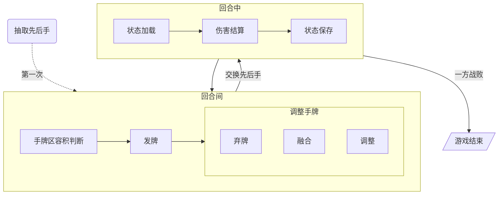
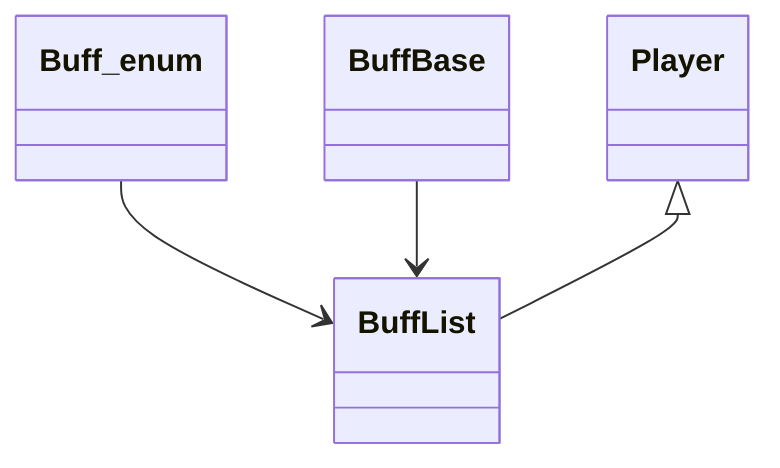

# 卡牌对战
---
## 玩法概要
* 双方各自拥有一定数量牌构成的`牌库`
* 双方在开始时各由`牌库`获取一定数量的`卡牌`
* 在`对战区`按一定顺序排列卡牌
* 抽取`先后手`顺序, 并按先后手顺序依次行动
* 每回合双方各获得1点`行动点`, 当行动点数量满足卡牌发动需求时消耗行动点发动卡牌, 直至行动点数少于卡牌需求, 转入下一方行动, 每轮次发放行动点总数固定且随轮次数增长增加
* 在轮次结束时由`牌库`随机抽取`一定数量`卡牌加入`手牌区`
* 轮次间可`调整`对战区卡牌
* `手牌区`可容纳一定数量卡牌, 容积满时`无法获取`新卡牌
* `相同卡牌`可进行融合, 提升数值
* 可对`手牌区`中卡牌进行`弃牌`, 累计弃牌一定数量时获取一张`万能牌`
* `万能牌`可与任何牌进行融合, 不可进入`对战区`, 不占用牌库容积
* 每轮次开始时`对调`先后手顺序
* 当一方`生命值`归零时游戏结束
* `牌库`清空后, 将`弃牌区`的所有手牌重新置入`牌库`

---

## 结构

* 卡牌信息导入类
* 卡牌类
* 伤害计算类
* 手牌区类
* 总体结构类

### 选牌

### 对战

## 机制设计
伤害计算公式
```c
伤害 = (攻击区 * 倍率区 + 附加伤害) * 增伤区 * 易伤区 * 防御区 * 减伤区
攻击区: 基础攻击力 * (1 + 攻击力提升百分比) + 攻击力提升数值
倍率区: 基础倍率 + 附加倍率
增伤区: (1 + 有效增伤之和) * (1 - 自身减伤增益率)之积
易伤区: 1 + 提高受到伤害之和
防御区: 防御力>0时: 20/(20 + 防御力) 防御力<0时:  (1 + 0.05 * 防御力) 
减伤区: (1 - 减伤率)之积

攻击方增伤总计:增伤区
受击方减伤总计:易伤区 * 防御区 * 减伤区
```
生存计算公式
```c
生命 = 基础生命 * 倍率区 + 额外提升
倍率区 = (1 + 生命提升百分比之和) * (1 - 生命降低百分比)之积
护盾 = 基础生命 * 转换率 + 固定值
```
有效进攻属性
```
buff:
提升自身x%攻击力
提升自身x攻击力
攻击时追加造成x%攻击力伤害
攻击时追加造成x伤害
提高x%造成的伤害
debuff:
使对方造成的伤害减少x%
使对方受到伤害提升x%
```
有效生存属性
```
buff:
增加自身x防御
使自身受到伤害减少x%
提升x%生命上限
提升x生命上限
获得x%生命值护盾
获得x生命值护盾
debuff:
减少对方x防御
减少对方x%生命值上限
```
基础数值
```
atk: 100
hp: 8000
def: 0
```

buff
```
力量 提升10攻击力/层
兴奋 提升10%攻击力/层
治愈 恢复50生命值/层
丰饶 提升25生命上限/层
净化 抵消1个最新debuff/层
坚韧 提升1点防御/层
乐符 提升6%造成的伤害/层
```
debuff
```
流血 轮次结束时, 造成10点追加伤害/层
易伤 使受到的伤害提高5%/层
脆弱 降低1点防御/层
虚弱 使造成的伤害降低5%/层
侵蚀 减少对方3%生命上限/层
恐惧 清除一个最新buff/层
```
控制
```
冻结 使我方立即行动, 并额外获得1个行动点
嘲讽 强制对方下回合使用攻击, 造成100%攻击力伤害
```
效果
```
法力 消耗以提升卡牌效果
壁垒 获得50生命值护盾/层
财富 造成1-6点追加伤害/层
反击 护盾受到伤害时, 立即造成100%攻击力伤害
召唤 获得召唤物, 拥有本体50%攻击力, 召唤物造成的伤害视为追加伤害
蓄能 记录倒计时5次, 回合结束时减少1次, 倒计时结束时造成50%攻击力伤害
```

## 类设计

* Cardbase 卡牌基类, 提供卡牌的基本信息
* Cardloder 加载卡牌, 生成对应数据

### 卡牌类

#### 脚本写入
* 类型
```cpp
enum class type{
    normal, //通用卡
    special, //特殊卡
    venue, //场地卡
};
```

* 行动费用
```cpp
size_t cost;
```
* 伤害效果
```cpp
size_t direct_damage;
size_t additional_damage;
```
* buff效果获得
```cpp
size_t buff_num;
size_t buff_id;
size_t buff_duration;
size_t buff_times;
```
* 特殊效果
```cpp
size_t sp_id;
size_t sp_buff_target;
```

### 类
```cpp
class CardBase
{
public:
	CardBase() = default;
	~CardBase() = default;
	bool isPlayCard(size_t cost);
	void ChangeCost(int num);
	void Play();
	const std::string GetName();
	const std::string& GetDescription();
private:
	size_t cost;
	std::vector<std::pair<size_t, Skill>> skillList;
	std::string name;
	std::string description;
};
```

### 类拓扑关系
